# MVS 데이터베이스 ERD

## 전체 ERD 다이어그램

```mermaid
erDiagram
    %% Core Tables
    Tenant ||--o{ Company : "has"
    Tenant ||--o{ User : "has"
    Tenant ||--o{ Menu : "has"
    Tenant ||--o{ Customer : "has"
    Tenant ||--o{ Product : "has"
    Tenant ||--o{ Project : "has"
    Tenant ||--o{ Payroll : "has"
    Tenant ||--o{ Attendance : "has"
    Tenant ||--o{ Vacation : "has"
    Tenant ||--o{ Performance : "has"
    Tenant ||--o{ WorkStatistic : "has"
    Tenant ||--o{ Approval : "has"
    Tenant ||--o{ Quotation : "has"
    Tenant ||--o{ RoomBooking : "has"
    Tenant ||--o{ WorkReport : "has"
    Tenant ||--o{ InventoryTransaction : "has"
    Tenant ||--o{ Partner : "has"

    Company ||--o{ User : "has"
    Company ||--o{ Customer : "has"
    Company ||--o{ Product : "has"
    Company ||--o{ Project : "has"
    Company ||--o{ Payroll : "has"
    Company ||--o{ Attendance : "has"
    Company ||--o{ Vacation : "has"
    Company ||--o{ Performance : "has"
    Company ||--o{ WorkStatistic : "has"
    Company ||--o{ Approval : "has"
    Company ||--o{ Quotation : "has"
    Company ||--o{ RoomBooking : "has"
    Company ||--o{ WorkReport : "has"
    Company ||--o{ InventoryTransaction : "has"
    Company ||--o{ Partner : "has"
    Company ||--o{ CompanyGstNumber : "has"

    User ||--o{ UserPermission : "has"
    User ||--o{ SalesOpportunity : "assigned_to"
    User ||--o{ SupportTicket : "assigned_to"
    User ||--o{ SupportResponse : "created"
    User ||--o{ Invoice : "created"
    User ||--o{ Product : "created"
    User ||--o{ Project : "manages"
    User ||--o{ Project : "creates"
    User ||--o{ Payroll : "employee"
    User ||--o{ Payroll : "creates"
    User ||--o{ Attendance : "has"
    User ||--o{ Vacation : "requests"
    User ||--o{ Vacation : "approves"
    User ||--o{ Performance : "has"
    User ||--o{ Performance : "reviews"
    User ||--o{ WorkStatistic : "has"
    User ||--o{ Approval : "requests"
    User ||--o{ Approval : "approves"
    User ||--o{ Quotation : "creates"
    User ||--o{ RoomBooking : "books"
    User ||--o{ RoomBooking : "creates"
    User ||--o{ WorkReport : "authors"
    User ||--o{ WorkReport : "reviews"
    User ||--o{ InventoryTransaction : "creates"

    Menu ||--o{ UserPermission : "has"

    %% Customer Management
    Customer ||--o{ SalesOpportunity : "has"
    Customer ||--o{ Contract : "has"
    Customer ||--o{ SupportTicket : "has"
    Customer ||--o{ Invoice : "has"
    Customer ||--o{ Project : "has"
    Customer ||--o{ Quotation : "has"

    Partner ||--o{ PartnerGstNumber : "has"

    %% Sales & CRM
    SalesOpportunity }o--|| Customer : "belongs_to"
    SalesOpportunity }o--|| User : "assigned_to"

    Contract }o--|| Customer : "belongs_to"

    SupportTicket }o--|| Customer : "belongs_to"
    SupportTicket }o--|| User : "assigned_to"
    SupportTicket ||--o{ SupportResponse : "has"

    SupportResponse }o--|| SupportTicket : "belongs_to"
    SupportResponse }o--|| User : "created_by"

    %% Invoice & Quotation
    Invoice }o--|| Customer : "belongs_to"
    Invoice }o--|| User : "created_by"
    Invoice ||--o{ InvoiceItem : "has"

    InvoiceItem }o--|| Invoice : "belongs_to"

    Quotation }o--|| Customer : "belongs_to"
    Quotation }o--|| User : "created_by"

    %% Product & Inventory
    Product }o--|| Tenant : "belongs_to"
    Product }o--|| Company : "belongs_to"
    Product }o--|| User : "created_by"
    Product ||--o{ InventoryTransaction : "has"

    InventoryTransaction }o--|| Product : "belongs_to"
    InventoryTransaction }o--|| User : "created_by"

    %% Project Management
    Project }o--|| Tenant : "belongs_to"
    Project }o--|| Company : "belongs_to"
    Project }o--o| Customer : "belongs_to"
    Project }o--|| User : "managed_by"
    Project }o--|| User : "created_by"

    %% HR Management
    Payroll }o--|| User : "employee"
    Payroll }o--|| User : "created_by"

    Attendance }o--|| User : "belongs_to"

    Vacation }o--|| User : "requested_by"
    Vacation }o--o| User : "approved_by"

    Performance }o--|| User : "belongs_to"
    Performance }o--o| User : "reviewed_by"

    WorkStatistic }o--|| User : "belongs_to"

    %% Work Management
    Approval }o--|| User : "requested_by"
    Approval }o--o| User : "current_approver"

    RoomBooking }o--|| User : "booked_by"
    RoomBooking }o--|| User : "created_by"

    WorkReport }o--|| User : "authored_by"
    WorkReport }o--o| User : "reviewed_by"

    %% Table Definitions
    Tenant {
        int id PK
        string name
        string domain
        string status
        datetime created_at
        datetime updated_at
    }

    Company {
        int id PK
        int tenant_id FK
        string name
        string business_number UK
        string ceo_name
        text address
        string phone
        string email
        string website
        string industry
        int employee_count
        string subscription_plan
        string subscription_status
        enum status
        blob company_logo
        blob company_seal
        blob ceo_signature
        string account_holder_name
        string bank_name
        text bank_address
        string account_number
        string ifsc_code
        string swift_code
        datetime created_at
        datetime updated_at
    }

    User {
        int id PK
        int tenant_id FK
        int company_id FK
        string userid UK
        string username
        string email UK
        string password_hash
        enum role
        string department
        string position
        enum status
        datetime last_login
        string employee_number
        date birth_date
        enum gender
        string phone
        text address
        string emergency_contact
        string emergency_phone
        date hire_date
        enum employment_type
        decimal salary
        datetime created_at
        datetime updated_at
    }

    Menu {
        int id PK
        int tenant_id FK
        int parent_id FK
        string name
        string path
        string icon
        int order
        boolean is_active
        datetime created_at
        datetime updated_at
    }

    UserPermission {
        int id PK
        int user_id FK
        int menu_id FK
        boolean can_view
        boolean can_create
        boolean can_edit
        boolean can_delete
        datetime created_at
        datetime updated_at
    }

    Customer {
        int id PK
        int tenant_id FK
        int company_id FK
        string name
        string email
        string phone
        text address
        string business_number
        string industry
        enum status
        datetime created_at
        datetime updated_at
    }

    Partner {
        int id PK
        int tenant_id FK
        int company_id FK
        string company_name
        string business_number
        string pan_number
        string representative
        enum business_type
        string industry
        text address
        string phone
        string email UK
        string website
        string bank_name
        string account_number
        date contract_start_date
        date contract_end_date
        enum status
        text notes
        datetime created_at
        datetime updated_at
    }

    CompanyGstNumber {
        int id PK
        int company_id FK
        string gst_number UK
        string state
        boolean is_primary
        datetime created_at
        datetime updated_at
    }

    PartnerGstNumber {
        int id PK
        int partner_id FK
        string gst_number UK
        string state
        boolean is_primary
        datetime created_at
        datetime updated_at
    }

    SalesOpportunity {
        int id PK
        int customer_id FK
        int assigned_to FK
        string title
        string description
        decimal amount
        enum stage
        enum probability
        date expected_close_date
        enum status
        datetime created_at
        datetime updated_at
    }

    Contract {
        int id PK
        int customer_id FK
        string contract_number UK
        string title
        text description
        decimal amount
        date start_date
        date end_date
        enum status
        datetime created_at
        datetime updated_at
    }

    SupportTicket {
        int id PK
        int customer_id FK
        int assigned_to FK
        string ticket_number UK
        string subject
        text description
        enum priority
        enum status
        datetime created_at
        datetime updated_at
    }

    SupportResponse {
        int id PK
        int ticket_id FK
        int user_id FK
        text response
        datetime created_at
        datetime updated_at
    }

    Invoice {
        int id PK
        int customer_id FK
        int created_by FK
        string invoice_number UK
        date invoice_date
        date due_date
        decimal subtotal
        decimal tax_amount
        decimal total_amount
        enum status
        enum payment_status
        datetime created_at
        datetime updated_at
    }

    InvoiceItem {
        int id PK
        int invoice_id FK
        string description
        int quantity
        decimal unit_price
        decimal amount
        datetime created_at
        datetime updated_at
    }

    Quotation {
        int id PK
        int tenant_id FK
        int company_id FK
        string quotation_number UK
        int customer_id FK
        string customer_name
        string customer_email
        string customer_phone
        text customer_address
        jsonb items
        decimal subtotal
        decimal tax_rate
        decimal tax_amount
        decimal discount
        decimal total_amount
        string currency
        date valid_until
        enum status
        text notes
        text terms
        int created_by FK
        datetime created_at
        datetime updated_at
    }

    Product {
        int id PK
        int tenant_id FK
        int company_id FK
        int created_by FK
        string product_code UK
        string name
        string description
        decimal price
        string unit
        int stock_quantity
        enum status
        datetime created_at
        datetime updated_at
    }

    InventoryTransaction {
        int id PK
        int tenant_id FK
        int company_id FK
        int product_id FK
        int created_by FK
        enum transaction_type
        int quantity
        decimal unit_price
        text notes
        datetime created_at
        datetime updated_at
    }

    Project {
        int id PK
        int tenant_id FK
        int company_id FK
        int customer_id FK
        string project_code UK
        string name
        text description
        string status
        string priority
        date start_date
        date end_date
        decimal budget
        decimal actual_cost
        int progress
        int project_manager FK
        int created_by FK
        datetime created_at
        datetime updated_at
    }

    Payroll {
        int id PK
        int tenant_id FK
        int company_id FK
        int employee_id FK
        int created_by FK
        string payroll_period
        decimal basic_salary
        decimal overtime_pay
        decimal bonus
        decimal allowances
        decimal deductions
        decimal gross_salary
        decimal net_salary
        decimal tax_amount
        string status
        date payment_date
        datetime created_at
        datetime updated_at
    }

    Attendance {
        int id PK
        int tenant_id FK
        int company_id FK
        int user_id FK
        date date
        datetime check_in
        datetime check_out
        decimal work_hours
        enum status
        text notes
        datetime created_at
        datetime updated_at
    }

    Vacation {
        int id PK
        int tenant_id FK
        int company_id FK
        int user_id FK
        enum vacation_type
        date start_date
        date end_date
        int days
        text reason
        enum status
        date applied_date
        int approved_by FK
        date approved_date
        text rejection_reason
        text attachments
        datetime created_at
        datetime updated_at
    }

    Performance {
        int id PK
        int tenant_id FK
        int company_id FK
        int user_id FK
        string review_period
        decimal overall_rating
        jsonb goals
        jsonb competencies
        jsonb strengths
        jsonb improvements
        text manager_comment
        text employee_comment
        enum status
        int reviewed_by FK
        datetime created_at
        datetime updated_at
    }

    WorkStatistic {
        int id PK
        int tenant_id FK
        int company_id FK
        int user_id FK
        string period
        decimal total_hours
        decimal productive_hours
        int tasks_completed
        int tasks_assigned
        decimal efficiency
        decimal productivity
        decimal attendance_rate
        decimal overtime_hours
        decimal break_time
        decimal focus_time
        decimal meeting_time
        decimal code_review_time
        decimal testing_time
        decimal documentation_time
        datetime created_at
        datetime updated_at
    }

    Approval {
        int id PK
        int tenant_id FK
        int company_id FK
        string document_id UK
        string title
        enum type
        string category
        decimal amount
        int requester_id FK
        text description
        jsonb attachments
        enum status
        enum priority
        int current_approver_id FK
        jsonb approval_flow
        date due_date
        jsonb comments
        datetime created_at
        datetime updated_at
    }

    RoomBooking {
        int id PK
        int tenant_id FK
        int company_id FK
        int user_id FK
        int created_by FK
        string room_name
        date booking_date
        time start_time
        time end_time
        text purpose
        enum status
        datetime created_at
        datetime updated_at
    }

    WorkReport {
        int id PK
        int tenant_id FK
        int company_id FK
        int author_id FK
        int reviewer_id FK
        string title
        text content
        enum status
        date report_date
        datetime created_at
        datetime updated_at
    }
```

## 주요 관계 요약

### 1. Core 계층
- **Tenant** → 다중 테넌트 지원의 최상위 엔티티
- **Company** → 각 테넌트 하위의 회사
- **User** → 회사 소속 사용자
- **Menu** → 시스템 메뉴 구조
- **UserPermission** → 사용자별 메뉴 권한

### 2. 고객 관리
- **Customer** → 고객 정보
- **Partner** → 파트너 업체
- **CompanyGstNumber** → 회사 GST 번호
- **PartnerGstNumber** → 파트너 GST 번호

### 3. 영업 및 CRM
- **SalesOpportunity** → 영업 기회
- **Contract** → 계약
- **SupportTicket** → 고객 지원 티켓
- **SupportResponse** → 지원 응답

### 4. 인보이스 및 견적서
- **Invoice** → 인보이스
- **InvoiceItem** → 인보이스 항목
- **Quotation** → 견적서

### 5. 제품 및 재고
- **Product** → 제품 정보
- **InventoryTransaction** → 재고 거래

### 6. 프로젝트 관리
- **Project** → 프로젝트

### 7. 인사 관리
- **Payroll** → 급여
- **Attendance** → 근태
- **Vacation** → 휴가
- **Performance** → 성과 평가

### 8. 업무 관리
- **WorkStatistic** → 업무 통계
- **Approval** → 전자 결제
- **RoomBooking** → 회의실 예약
- **WorkReport** → 업무 보고서

## 주요 특징

1. **다중 테넌트 구조**: 모든 주요 테이블이 `tenant_id`를 포함하여 다중 테넌트 지원
2. **회사별 격리**: `company_id`를 통한 회사별 데이터 격리
3. **사용자 중심**: 대부분의 테이블이 `User`와 관계를 가짐
4. **감사 추적**: `created_by`, `created_at`, `updated_at` 필드를 통한 감사 추적
5. **소프트 삭제**: `status` 필드를 통한 소프트 삭제 지원

