# MVS 데이터베이스 ERD (간소화 버전)

## 핵심 엔티티 관계도

```mermaid
graph TB
    subgraph "Core"
        T[Tenant]
        C[Company]
        U[User]
        M[Menu]
        UP[UserPermission]
    end

    subgraph "Customer Management"
        CU[Customer]
        P[Partner]
        CG[CompanyGstNumber]
        PG[PartnerGstNumber]
    end

    subgraph "Sales & CRM"
        SO[SalesOpportunity]
        CT[Contract]
        ST[SupportTicket]
        SR[SupportResponse]
    end

    subgraph "Invoice & Quotation"
        I[Invoice]
        II[InvoiceItem]
        Q[Quotation]
    end

    subgraph "Product & Inventory"
        PR[Product]
        IT[InventoryTransaction]
    end

    subgraph "Project Management"
        PJ[Project]
    end

    subgraph "HR Management"
        PY[Payroll]
        A[Attendance]
        V[Vacation]
        PE[Performance]
    end

    subgraph "Work Management"
        WS[WorkStatistic]
        AP[Approval]
        RB[RoomBooking]
        WR[WorkReport]
    end

    %% Core Relationships
    T -->|1:N| C
    T -->|1:N| U
    T -->|1:N| M
    C -->|1:N| U
    U -->|1:N| UP
    M -->|1:N| UP

    %% Customer Relationships
    T -->|1:N| CU
    C -->|1:N| CU
    T -->|1:N| P
    C -->|1:N| P
    C -->|1:N| CG
    P -->|1:N| PG

    %% Sales & CRM Relationships
    CU -->|1:N| SO
    CU -->|1:N| CT
    CU -->|1:N| ST
    U -->|1:N| SO
    U -->|1:N| ST
    U -->|1:N| SR
    ST -->|1:N| SR

    %% Invoice & Quotation Relationships
    CU -->|1:N| I
    CU -->|1:N| Q
    U -->|1:N| I
    U -->|1:N| Q
    I -->|1:N| II

    %% Product & Inventory Relationships
    T -->|1:N| PR
    C -->|1:N| PR
    U -->|1:N| PR
    PR -->|1:N| IT
    U -->|1:N| IT

    %% Project Relationships
    T -->|1:N| PJ
    C -->|1:N| PJ
    CU -->|1:N| PJ
    U -->|1:N| PJ

    %% HR Relationships
    T -->|1:N| PY
    C -->|1:N| PY
    U -->|1:N| PY
    T -->|1:N| A
    C -->|1:N| A
    U -->|1:N| A
    T -->|1:N| V
    C -->|1:N| V
    U -->|1:N| V
    U -->|1:N| V
    T -->|1:N| PE
    C -->|1:N| PE
    U -->|1:N| PE
    U -->|1:N| PE

    %% Work Management Relationships
    T -->|1:N| WS
    C -->|1:N| WS
    U -->|1:N| WS
    T -->|1:N| AP
    C -->|1:N| AP
    U -->|1:N| AP
    U -->|1:N| AP
    T -->|1:N| RB
    C -->|1:N| RB
    U -->|1:N| RB
    T -->|1:N| WR
    C -->|1:N| WR
    U -->|1:N| WR
    U -->|1:N| WR
```

## 테이블 목록 (총 28개)

### Core (5개)
1. tenants
2. companies
3. users
4. menus
5. user_permissions

### Customer Management (4개)
6. customers
7. partners
8. company_gst_numbers
9. partner_gst_numbers

### Sales & CRM (4개)
10. sales_opportunities
11. contracts
12. support_tickets
13. support_responses

### Invoice & Quotation (3개)
14. invoices
15. invoice_items
16. quotations

### Product & Inventory (2개)
17. products
18. inventory_transactions

### Project Management (1개)
19. projects

### HR Management (4개)
20. payrolls
21. attendances
22. vacations
23. performances

### Work Management (4개)
24. work_statistics
25. approvals
26. room_bookings
27. work_reports

### 기타 (1개)
28. (추가 테이블이 있을 수 있음)

